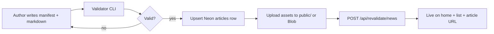

# Master prompt: Design a token-free news publishing pipeline for mychennaicity.in

Copy everything below the line into your external AI tool, Notion, or briefing doc when designing an app **outside** the Cursor development environment.

---

## Role

You are a **systems architect and product designer** for a local news website. Your job is to design a **deterministic, low-cost publishing pipeline** that lets a non-developer editorial team publish Chennai local news to **mychennaicity.in** **without using LLM tokens per article**.

The existing production site is a **Next.js 16** app on **Vercel**, with **Neon PostgreSQL** as the single source of truth for articles. Today, articles are inserted via **TypeScript seed scripts** run from the command line. Your design must improve on that while staying compatible with the current schema and URLs.

---

## 1. Basis — what already exists (do not reinvent)

### Product

- **Brand:** mychennaicity.in — Chennai-area local news, jobs, events, area guides.
- **News URLs:**
  - List: `/chennai-local-news`
  - Topic hubs: `/chennai-local-news/topic/{politics|elections|…}`
  - Article: `/chennai-local-news/{slug}`
- **Discovery surfaces (all read from DB on each request):**
  - **Home:** featured articles (`featured = true`, newest first) + bulletin grid (latest published, limit 12).
  - **News list:** all `published` articles for city `chennai`, ordered by `published_at` DESC.
  - **Article page:** full markdown body, SEO metadata, optional interactive block, source attribution.

### Data model (`articles` table)

| Field | Type | Required | Purpose |
|-------|------|----------|---------|
| `city_id` | UUID | yes | FK to `cities` where `slug = 'chennai'` |
| `slug` | text | yes | URL segment; unique per city; never reuse for a different story |
| `title` | text | yes | Headline; keep SERP-friendly length |
| `summary` | text | recommended | Meta description / card excerpt |
| `dek` | text | optional | Short display line under headline |
| `body` | text | yes | Full article markdown (`reportBody` + `---` + `analysisBody` if split) |
| `report_body` | text | recommended | Factual report section (markdown) |
| `analysis_body` | text | recommended | Chennai-context analysis (markdown) |
| `category` | text | yes | Controlled vocab e.g. Politics, Civic, Environment |
| `status` | enum | yes | `draft` \| `published` \| `archived` |
| `published_at` | timestamptz | yes for publish | ISO UTC; drives sort order on home/list |
| `featured` | boolean | default false | `true` → home editor picks |
| `hero_image_url` | text | recommended | `/images/...` self-hosted or HTTPS CDN URL |
| `source_url` | text | recommended | Primary source (often official PDF on site) |
| `source_name` | text | recommended | Human-readable source label |
| `author_byline` | text | optional | e.g. `mychennaicity.in editorial` |
| `interactive_json` | JSONB | optional | `checklist` \| `faq` \| `poll` \| `takeaways` \| `howto` |
| `area_hub_slug` | text | optional | Must match known Chennai zone slug if set |

### Static assets

- Official PDFs and images live under **`public/`** → served at `https://mychennaicity.in/documents/...` or `/images/articles/...`.
- Do **not** store PDFs or images in the database.

### Post-publish cache

- `POST /api/revalidate/news?secret={REVALIDATE_SECRET}&slug={optional}` busts edge cache for home, news hub, and one article.
- Listings already query Neon live; revalidate is optional but recommended immediately after publish.

### Reference implementation (today)

- Seed script pattern: `scripts/seed-{story-slug}.ts` using Drizzle + `@neondatabase/serverless`.
- Commands: `npm run db:seed:{name}` (dev DB) and `npm run db:seed:{name}:live` (production via `.env.production.local`).
- Example live story: `tamil-nadu-ias-reshuffle-collectors-may-2026` with PDF at `/documents/Tamilnadu-Collectors-Reshuffle-May-2026-IAS TN_1780065440019.pdf`.

### Editorial content shape (markdown convention)

1. **Report block** — What happened, dates, tables, official order numbers, downloadable PDF link in first sections.
2. **Analysis block** — Why Chennai readers care, neighbourhood impact, what to watch next.
3. **Separator** — `---` between report and analysis in combined `body`.
4. **Interactive** — Optional checklist or FAQ JSON (no LLM required; pick template and fill fields).

---

## 2. Inputs the system must accept

Design the pipeline around these **structured inputs** (no free-form chat):

### A. Story manifest (required) — YAML or JSON file

```yaml
slug: tamil-nadu-ias-reshuffle-collectors-may-2026
title: "Tamil Nadu transfers 40 IAS officers: 14 collectors reshuffled in May 2026 G.O."
summary: "One-sentence factual lead for cards and meta description."
dek: "Optional subhead for article hero."
category: Politics
status: published
published_at: "2026-05-29T05:30:00+00:00"
featured: true
hero_image_url: /images/articles/tamil-nadu-cabinet-portfolios-hero.jpg
source_url: https://mychennaicity.in/documents/....pdf
source_name: "Tamil Nadu Public (Special-A) — G.O. (Rt.) No. 1883, 29.05.2026 (PDF)"
author_byline: mychennaicity.in editorial
area_hub_slug: null
interactive:
  type: checklist
  title: "Five follow-ups after a collector reshuffle"
  items:
    - id: go-pdf
      label: "Download and archive the official G.O. PDF"
```

### B. Content files (required)

| File | Purpose |
|------|---------|
| `report.md` | Factual sections, tables, timelines |
| `analysis.md` | Local impact, Chennai angle, related links |
| OR single `body.md` | If not splitting report/analysis |

### C. Media (as needed)

| Asset | Where it goes | Input |
|-------|---------------|-------|
| Hero image | `public/images/articles/{slug}.jpg` | JPEG/WebP path or upload |
| Official PDF | `public/documents/{folder}/{filename}.pdf` | File upload; URL must be stable |

### D. Environment / secrets (ops only)

| Secret | Used for |
|--------|----------|
| `DATABASE_URL` | Neon insert/update |
| `REVALIDATE_SECRET` | POST revalidate after publish |
| `NEXT_PUBLIC_SITE_URL` | `https://mychennaicity.in` |

### E. Optional human checklist (no AI)

- [ ] Slug is unique and kebab-case
- [ ] `published_at` is correct IST→UTC
- [ ] PDF uploaded before `source_url` goes live
- [ ] `featured` used sparingly (≤3 active picks)
- [ ] Category matches topic hub mapping

---

## 3. Process — how publishing should work (no tokens per story)

Describe and implement a **linear pipeline** with fixed steps. LLM may be used **once** to design templates; **not** on every publish.



### Step 1 — Authoring (human + templates)

- Provide **Notion/Google Doc templates** mirroring `report.md` / `analysis.md` headings (`## Key takeaways`, `## Fact box`, tables).
- Author fills manifest YAML + markdown offline.

### Step 2 — Validation (deterministic code)

CLI checks:

- Slug format `^[a-z0-9]+(-[a-z0-9]+)*$`
- Required fields present
- `body` length minimum (e.g. 500 chars)
- `published_at` parseable
- `source_url` returns 200 if hosted on mychennaicity.in
- `interactive` matches allowed JSON schema
- No duplicate `(city_id, slug)` unless intentional update

### Step 3 — Publish (deterministic code)

- Resolve `chennai` `city_id` from DB.
- `INSERT ... ON CONFLICT (city_id, slug) DO UPDATE` (same as current seed scripts).
- Set `body = report + "\n\n---\n\n" + analysis` when split files used.
- Set `updated_at = now()`.

### Step 4 — Assets

- Copy PDF/image into `public/` **or** upload to Vercel Blob and store HTTPS URL in `hero_image_url` / link in markdown.

### Step 5 — Cache revalidate

- `POST https://mychennaicity.in/api/revalidate/news?secret=...&slug=...`

### Step 6 — Verify

- Automated: HTTP 200 on article URL, title contains headline, PDF link 200.
- Human: spot-check home card + mobile article layout.

### What to avoid

- Pasting full articles into ChatGPT for each publish (token cost + drift).
- Maintaining parallel static markdown routes and DB (SEO duplicate risk).
- Reusing slugs for different stories.

---

## 4. Output — intended results per publish

| Output | Success criteria |
|--------|------------------|
| **Database row** | One `articles` row, `status=published`, `published_at` set |
| **Public article** | `https://mychennaicity.in/chennai-local-news/{slug}` returns 200 |
| **Home visibility** | Appears in bulletin; if `featured=true`, in editor picks |
| **News list** | Row visible sorted by date on `/chennai-local-news` |
| **Topic hub** | If category maps to topic, listed under `/chennai-local-news/topic/{topic}` |
| **SEO** | `summary` → meta description; JSON-LD NewsArticle generated by site |
| **Source block** | Footer shows `source_name` + link to PDF or external URL |
| **Sitemap** | URL included on next sitemap generation crawl |
| **Audit log** | Optional: who published, when, manifest hash |

---

## 5. Solution options to compare (pick one or hybrid)

Ask the designer to evaluate:

| Option | Token cost | Dev effort | Editor UX |
|--------|------------|------------|-----------|
| **A. Folder + CLI** (`content/inbox/{slug}/` + `npm run news:publish`) | Zero | Low | Technical |
| **B. Lightweight admin UI** (form + markdown textarea, RBAC) | Zero | Medium | Friendly |
| **C. Headless CMS** (Sanity/Strapi) sync to Neon | Zero* | Medium–High | Friendly |
| **D. Git-based PR workflow** (manifest in repo, CI publishes) | Zero | Medium | Git-savvy |

*CMS may have its own subscription; still no per-article LLM tokens.

**Recommended hybrid for this project:** **A now** (generalise existing seed scripts into one `news:publish --manifest inbox/story.yaml`) + **B later** (admin CRUD per `ADMIN_SYSTEM_PLAN.md`).

---

## 6. Deliverables your design document must include

1. **User journeys** — draft → preview → publish → unpublish.
2. **Folder structure** for inbox content and assets.
3. **JSON Schema** for manifest + `interactive_json`.
4. **CLI commands** and exit codes.
5. **Database upsert SQL or ORM pseudocode**.
6. **Rollback** — set `status=archived` without deleting slug.
7. **Security** — who can run publish; secrets handling; no `DATABASE_URL` in browser.
8. **Cost estimate** — Neon rows, Vercel invocations, zero OpenAI per article.
9. **Migration path** from current `scripts/seed-*.ts` files.
10. **Wireframes** (optional) for admin publish screen.

---

## 7. Constraints (hard requirements)

- Single source of truth: **Neon `articles` table** only.
- City scope: **`chennai`** unless product expands.
- URLs must remain `/chennai-local-news/{slug}`.
- Preserve editorial split: **report** vs **analysis**.
- Official documents: **host on mychennaicity.in** when possible; link in `source_url`.
- Publishing must work **without Cursor** and **without an LLM API call per story**.

---

## 8. Example acceptance test

**Given** manifest `inbox/tn-ias-reshuffle/manifest.yaml` and `report.md`, `analysis.pdf` uploaded to `public/documents/...`  
**When** operator runs `news:publish tn-ias-reshuffle --live`  
**Then**:

1. Production DB contains slug `tamil-nadu-ias-reshuffle-collectors-may-2026`.
2. Home page shows the story in the latest bulletin within 60 seconds.
3. Article page download link returns PDF 200.
4. Revalidate endpoint returns `{ "ok": true }`.

---

## 9. One-paragraph design brief (elevator pitch)

Build a **manifest-driven publishing CLI and optional admin UI** that upserts structured Chennai news stories into Neon PostgreSQL, uploads PDFs/images to static hosting, and triggers cache revalidation—mirroring the proven `seed-tn-ias-reshuffle-may-2026` pattern so editors publish in minutes with **zero LLM tokens per article**, while the public site continues to serve home cards, news lists, and article pages from the database.

---

*End of copy-paste prompt. Repository reference: `scripts/seed-tn-ias-reshuffle-may-2026.ts`, `docs/CONTENT_ARCHITECTURE.md`, `docs/ADMIN_SYSTEM_PLAN.md`.*
